# Объединение сервисов через SSO и работа с данными для аналитики

## Задание 1. Повышение безопасности системы

### Задача 1. Предложите архитектурное решение и доработайте диаграмму C4 для управления учётными данными пользователя.

Решение:
- Использовать IAM (Keycloak) с собственным хранилищем для:
    - передачи credentials IdP для аутентификации;
    - реализации workflow работы с токенами (создание, инвалидация, перевыпуск, отзыв);
    - реализации workflow работы с пользовательскими сессиями (создание, завершение).
- Реализовать сервис (auth-service на Python + FastAPI) в качестве точки входа для всех сервисов с запросами аутентификации и авторизации.
- Реализовать интеграцию IAM с региональными системами хранения данных пользователей (Regional IdP):
    - проверка предоставленных учетных данных пользователей;
    - реализация принципа локального хранения данных пользователей;
    - использование существующих систем хранения аутентификационных данных.
- Реализовать session-cache сервис для хранения сессионных данных в течении срока жизни.

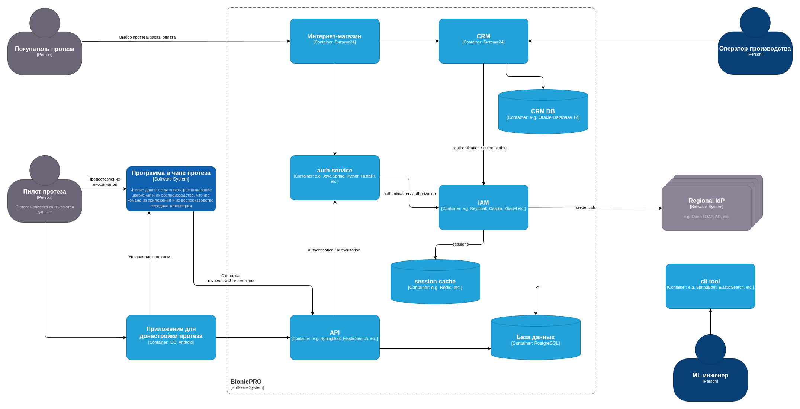

### Задача 2. Улучшите безопасность существующего приложения, заменив Code Grant на PKCE.

Данное задание было выполнено в соответствии с порядковым номером, после чего код был изменен в соответствии с требованиями задания 1.3.
В текущем отчете представлена реализация для двух вариантов хранения токенов: на фронте и на бэке.

#### Использование PKCE при хранении токенов на фронте

Код можно найти в комите [2d67e97](https://github.com/turistigor/yap-arch-task9-bionicpro-sso/pull/1/changes/2d67e9796df9e404a0b6b247f01e80f4035edb95). 

Для включения PKCE были проделаны следующие действия:

- включение для клиента reports-frontend в админке keycloak

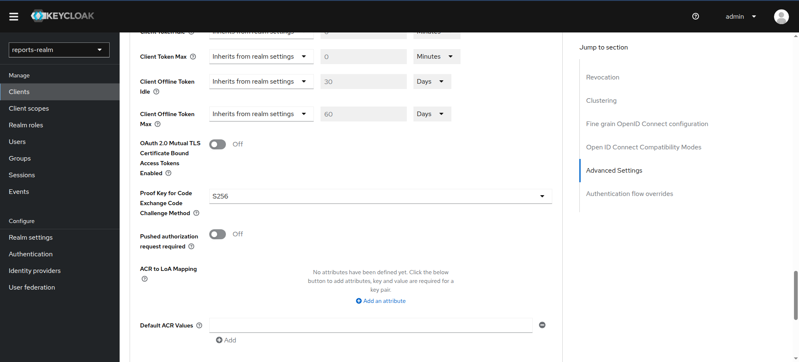

- включение со стороны клиента через параметры ReactKeycloakProvider

[Исходники](./frontend/src/App.tsx)

```ts
const App: React.FC = () => {
  return (
    <ReactKeycloakProvider
      authClient={keycloak}
      initOptions={{
        onLoad: 'login-required',
        pkceMethod: 'S256'
      }}
    >
      <div className="App">
        <ReportPage />
      </div>
    </ReactKeycloakProvider>
  );
};
```

Как запрос аутентификации выглядел до включения PKCE:

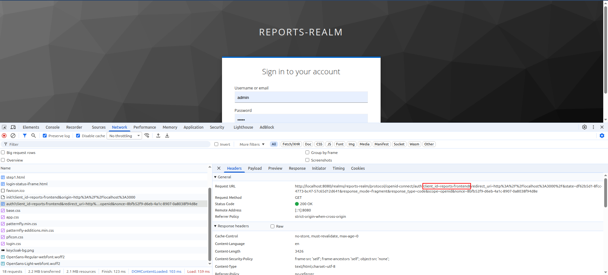

Как запрос аутентификации выглядел после включения PKCE:
- отправка code_challenge

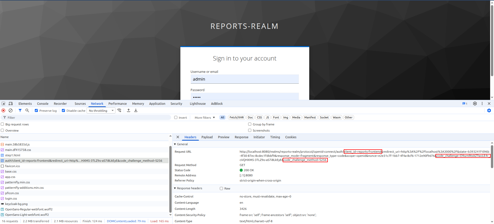

- отправка code_verifier

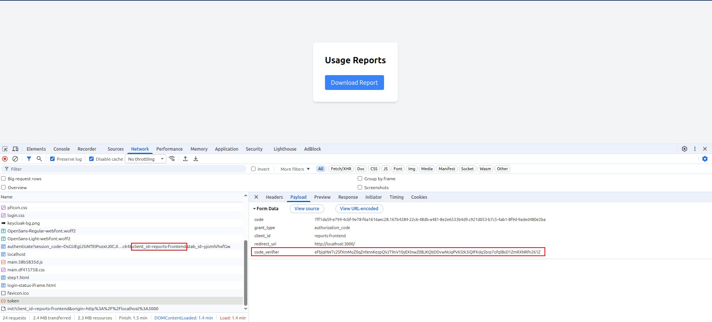

#### Использование PKCE при хранении токенов на бэке

Взаимодействие с Keycloak сосредоточено в сервисе [auth](./auth). С кодом можно ознакомиться в файлах:
- [auth/src/api/auth.py](./auth/src/api/auth.py)
- [auth/src/auth/keycloak.py](./auth/src/auth/keycloak.py)

Более подробное описание содержится в следующем разделе.

### Задача 3. Обеспечьте безопасное получение и хранение access-и refresh-токенов.

Задача реализована в сервисе [auth](./auth)

Для запуска выполнить:
```bash
cp .env.example .env
# edit auth/.env according to the hints inside

docker compose up -d
```

**Интеграция с Keycloak, перенос работы с токенами и сессиями**

Интеграция реализована при помощи библиотеки [python-keycloak](https://pypi.org/project/python-keycloak/).  

1. Пользовательский запрос на аутентификацию (/login) перенаправляется в Keycloak с:
   - code_challenge и state в query для последующего возврата после успешной аутентификации;
   - code_verifier и state в Secure, HttpOnly cookies (через [starlet.SessionMiddleware](https://starlette.dev/middleware/#sessionmiddleware)), зашифрованные при помощи SESSION_SECRET_KEY как эталонные значения для проверки в /callback после успешной аутентификации (cookie session в Response headers).

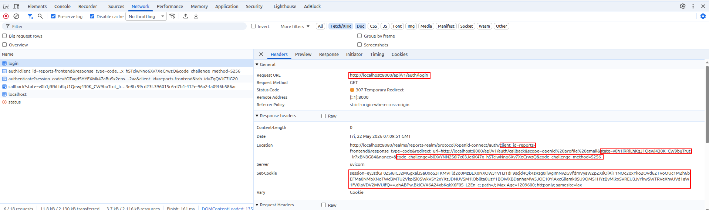

2. Пользователь получает и заполняет форму аутентификации, после чего отправляет её в Keycloak.

3. Успешная аутентификация перенаправляется в /callback с ранее переданными state и полученным от Keycloak code:
  - сервис проверяет совпадение state из query со state из cookie;
  - сервис отправляет запрос в Keycloak для получения токенов в обмен на code (из query) и code_verifier (из cookie);
  - создается сессия (с сохранением в Redis), содержащая токены и информацию о них;
  - фронтенду возвращается session_id (Secure, HttpOnly cookie) и презентационные сведения о пользователе (имена, почта и т.д.).

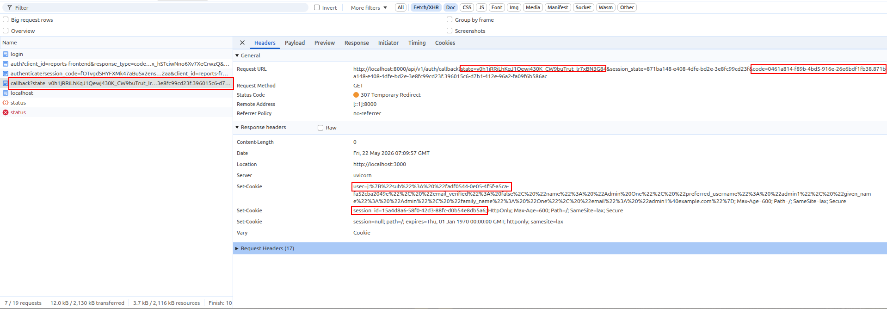

4. Фронтенд отображает интерфейс аутентифицированного пользователя.

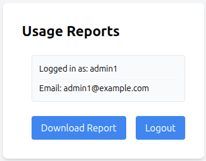


Диаграмма последовательно реализованного процесса аутентификации.

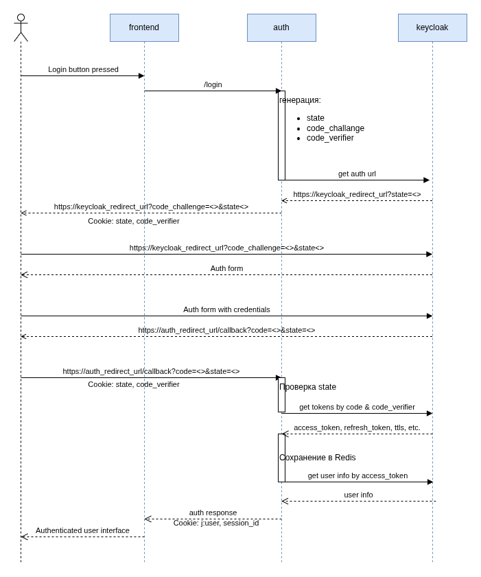


**Workflow токенов**

После получения в сервисе auth токены хранятся в зашифрованном виде в Redis. Ключ шифрования задается как env-переменная TOKEN_ENCRYPT_KEY. Связь между токенами и сессией обеспечивается за счет того, что session_id является ключом в Redis, а токены сохранены в значении для этого ключа. Пользователю отдается session_id (HttpOnly, Secure cookie), генерируемое при каждой успешной аутентификации.

Обновление access_token-а осуществляется автоматически при проверке статуса (/status) или обращении другого сервиса за авторизацией (/me). В случае устаревания refresh_token сессия считается завершенной, требуется повторная аутентификация.

TTL: 
- для access_token-а установлено в [realm-export.json](keycloak/realm-export.json) (accessTokenLifespan).
- для refresh_token (всей сессии) по умолчанию составляет 10 часов (или 30 минут в случае простоя) (В интерфейсе: Realm settings -> Sessions -> SSO Session Idle / SSO Session Max).

Ротация session_id осуществляется при смене access_token-а. TTL access_token мало, потому ротацию с таким таймаутом считаю достаточной для защиты от session fixation attack.

Замены access_token и session_id происходят без участия пользователя.

### Задача 4. Добавьте LDAP для возможности получения данных о пользователях представительства BionicPRO в другой стране.

Настройка интеграции и mapping ролей произведены через web-интерфейс Keycloak.

Проведенная настройка для интеграции Keycloak c LDAP показана на скринах:

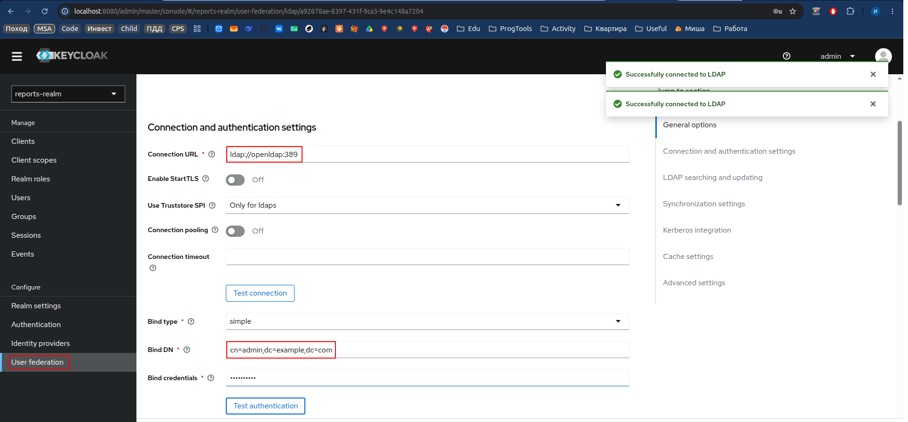

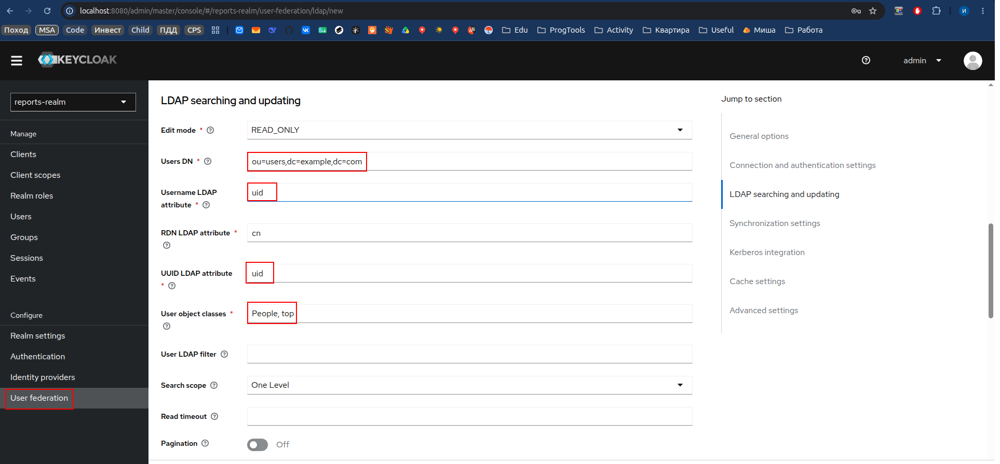

Так как имена ролей в LDAP и Keycloak имеют одинаковое написание, выбран role-ldap-mapper.  
Настройки на скрине ниже:

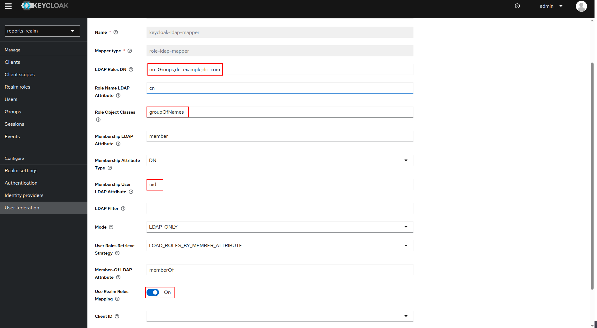

Результат содержится в экспортированном [keycloak-results-export.json](keycloak/keycloak-results-export.json).


### Задача 5. Настройте MFA.

Настройка через web-интерфейс Keycloak представлена на скринах.


Authentication -> Flows (tab) -> browser

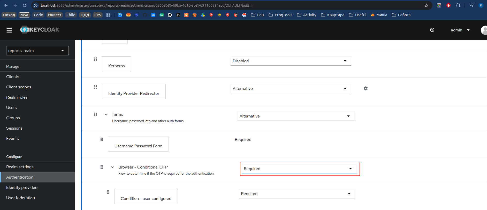

Authentication -> Required actions

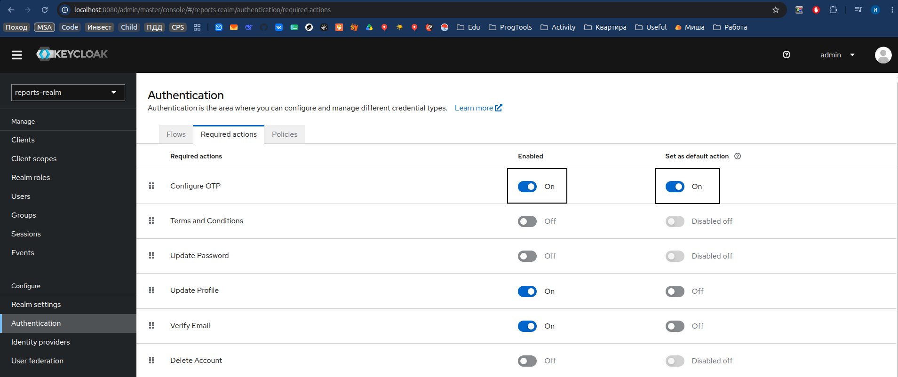

Результат содержится в экспортированном [keycloak-results-export.json](keycloak/keycloak-results-export.json).

### Задача 6. Добавьте OAuth 2.0 от Яндекс ID.

Для реализации необходимо:
- создать Identity Provider в Keycloak,
- добавить ваше приложение в [Yandex ID OAuth](https://oauth.yandex.ru/).

**Настройка через web-интерфейс Keycloak представлена на скринах.**

Redirect URI должен быть таким же как в Yandex ID OAuth. Alias является частью, формирующей  Redirect URI.

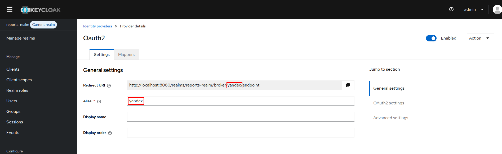

Client ID и Client Secret выдаются в Yandex ID OAuth при регистрации своего приложения.

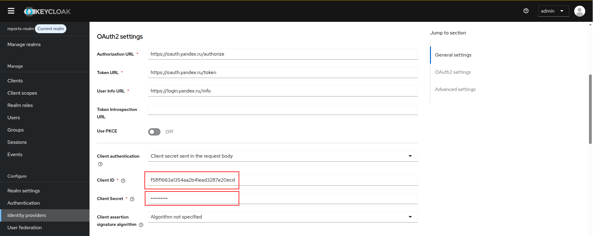

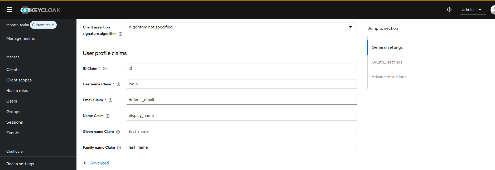

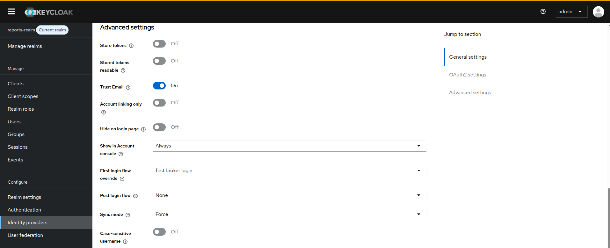

**Настройки в Yandex ID OAuth представлены на скринах.**

Redirect URI должен быть таким же как в Keycloak.

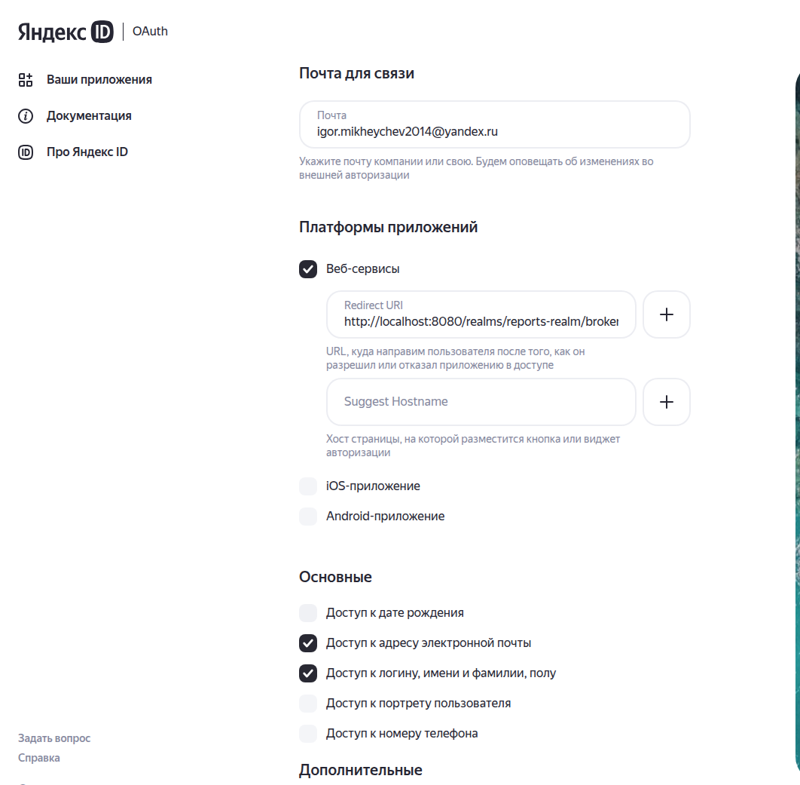

Результат содержится в экспортированном [keycloak-results-export.json](keycloak/keycloak-results-export.json).

Для работы необходимо заполнить identityProviders -> yandex -> clientId & clientSecret вашими учетными данными, полученными в [Yandex ID OAuth](https://oauth.yandex.ru/) при регистрации приложения.


## Задание 2. Разработка сервиса отчётов.

### Задача 1. Создать архитектуру решения для подготовки и получения отчётов.

C4 containers Bionicpro с добавлением функционала отчетов.


ER-диаграмма структуры данных в телеметрической (tm_db), операционной (crm_db) и аналитической базах (olap_db) данных.


Использование БД временных рядов является стандартным решением для хранения телеметрии. В данном случае была выбрана InfluxDB3 как один из самых распространенных вариантов.
<details>
<summary>Процесс развертывания свежей версии (v3) оказался несколько запутанным, потому оставлю пару строк для справки и на память.</summary>
<a href="https://docs.influxdata.com/influxdb3/core/get-started/setup/#docker-compose-with-a-mounted-file-system-object-store">Инструкция по написанию compose-файла</a>. Итоговая конфигурация изменена из-за проблем с доступом внутри контейнера. А ещё конфигурация не работает без токена авторизации.</br>
Токен авторизации <a href="https://docs.influxdata.com/influxdb3/core/get-started/setup/#set-up-authorization">штатно предлагается получать ручным вводом команд и копированием </a>.Такой вариант не подходит так как нужно автоматическое развертывание.</br>
Для его осуществления есть механизм <a href="https://docs.influxdata.com/influxdb3/core/admin/tokens/admin/preconfigured/"> Преднастроенных админских токенов</a>. Его использование описано <a href="https://docs.influxdata.com/influxdb3/core/admin/tokens/admin/preconfigured/#use-docker-compose-with-preconfigured-admin-tokens">тут</a>
</details>

### Задача 2. Разработать Airflow DAG и настроить его на запуск по расписанию.

Развертывание Airflow осуществляется на основе двух контейнеров: БД (airflow_db) и исполнителя (airflow) в режиме standalone. Этот способ отличается от предложенного в лекции, в котором разворачиваются web-server, scheduler, initializer, worker, triggerer, cli, database.
<details>
<summary>
Причины изменений.
</summary>
Приведенный пример актуален для airflow 2, в то время как на текущий момент актуальной является версия airflow 3. Механизм развертывания претерпел заметные изменения. С частью из них мне удалось разобраться, но потратив много времени, я не смог разобраться со всеми и принял решение использовать более простой вариант.
Понимаю, что в реальном production-окружении модульная архитектура имеет преимущества: независимое масштабирование, отказоустойчивость, независимое обновление и развертывание. Однако в данном случае я счел возможным использовать standalone-режим.
</details>
</br>

Код DAG-а представлен в [файле](./data_pipeline/dags/report_dag.py), сопутствующие исходники и конфиги в [директории](./data_pipeline/).

Заполнение телеметрической БД [тестовыми данными](./telemetry_db/data.csv) осуществляется в рамках запуска DAG-а (задача create_telemetry_db).
В БД присутствуют данные для пользователей из Keycloak (prothetic1-3) и LDAP(john.doe, alex.johnson).
<details>
<summary>Причины</summary>
InfluxDB3 перестала поддерживать механизм инициализации скриптами через папку docker-entrypoint-initdb.d. Теперь это <a href=https://docs.influxdata.com/influxdb3/core/get-started/write>Schema-on-Write БД</a>. В реальном сервисе операции записи заполнили бы БД без начальной разметки. В нашем задании операции записи не предусмотрены, потому я реализовал заполнение в DAGе из-за простоты (поднято окружение с необходимыми зависимостями).
</details>
</br>

Особенности работы DAGа и его окружения:
- Запуск с периодичностью в 1 день.
- Стартовая дата: 2026-06-03.
- В tm_db есть данные за 2026-06-03.
- Можно увидеть заполнение olap_db в запуске DAGа за 2026-06-04 так как отчет формируется за прошедшие сутки.
- При первом запуске будут созданы и осуществлены запуски DAGа для всех пропущенных периодов (catchup is True).
- DAG запускается автоматически при старте Airflow (is_paused_upon_creation is False).

Такая настройка позволяет организовать сохранение отчетов по имеющимся телеметрическим данным в olap_db (ClickHouse).

Витрина данных "bionicpro"."reports" в ClickHouse доступна через [web-интерфейс](http://localhost:8123/play).

### Задача 3. Создайте бэкенд-часть приложения для API.

Бэкенд отчетов реализован в сервисе [reports](./reports).
Отчет формируется на основе запроса к olap_db без сложных вычислений за переданный в query-string период (дискретность - день). При формировании отчета производится агрегация записей в olap_db, если таких было найдено несколько за интересующий период. Эти вычисления не являются тяжелыми.

### Задача 4. Реализуйте ограничение доступа к эндпоинту отчётности.

Невозможно получить доступ к функционалу отчетов без аутентификации.

Каждый отчет формируется для пользователя, под которым отправитель зарегистрирован в системе.

### Задача 5. Добавьте в UI кнопку получения отчёта и вызова эндпоинта его генерации.

В интерфейсе реализованы:
- кнопка загрузки отчета для пользователя;
- виджет выбора даты отчета (есть данные за 2026-06-03);
- таблица с данными отчета.

Пример отчета с данными:

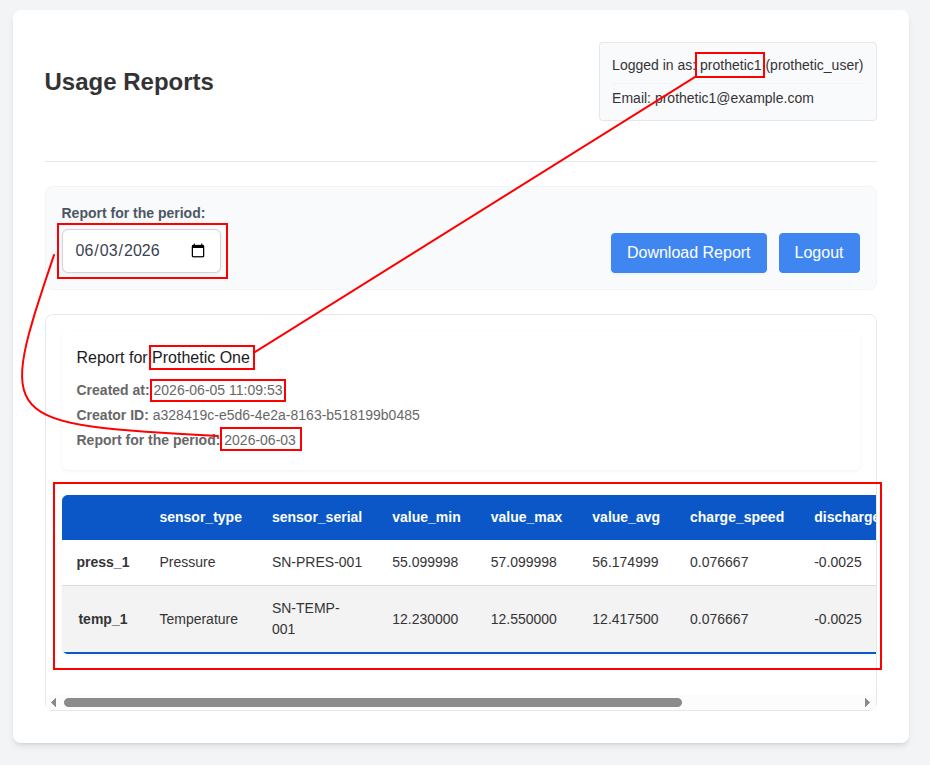

В случае отсутствия данных за интересующий день отчет будет пустым:

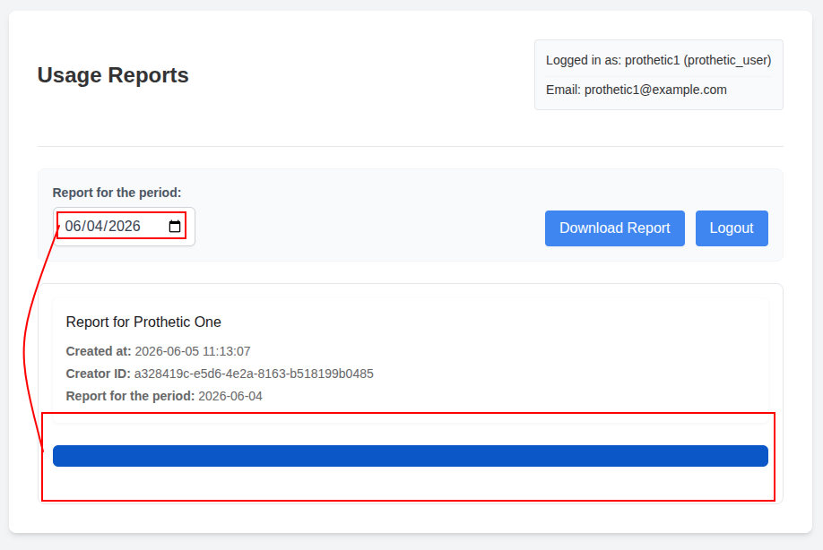
